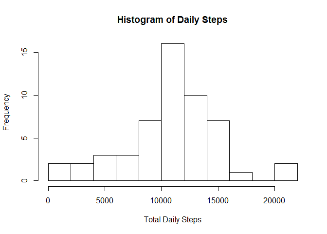
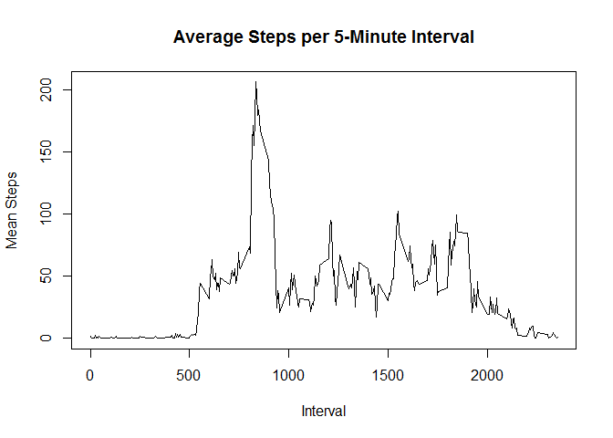
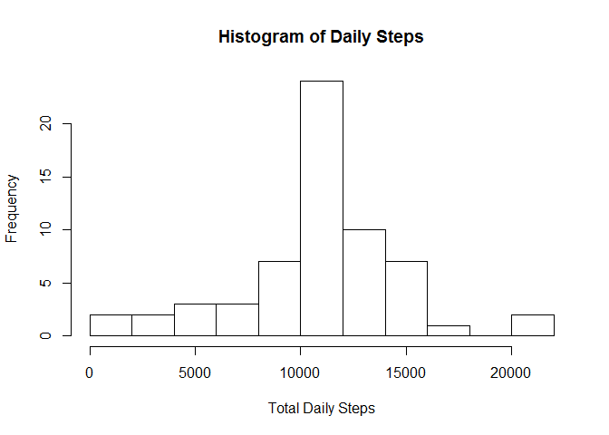
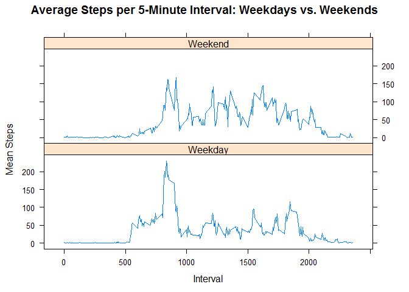

# Reproducible Research: Peer Assessment 1

Author: Jennifer Campbell  
Class: Reproducible Research, week 2, project 1  
Date: May 20, 2017  
Aim: Write a report that answers the questions detailed below. Ultimately, complete the entire assignment in a single R markdown document that can be processed by knitr and be transformed into an HTML file.  
This analysis has been conducted on a Windows machine running on Windows 10.  

## Loading and preprocessing the data
In the first step of the analysis, check whether the input data file activity.csv is in the working directory, and then download and unzip the file if necessary:


```r
if(!file.exists("activity.csv")){
    url <- "https://d396qusza40orc.cloudfront.net/repdata%2Fdata%2Factivity.zip"
    download.file(url, destfile='activity.zip', method="wininet", mode="wb")
    unzip(zipfile = "activity.zip")
}
```

Then we can read in the data:  

```r
df <- read.csv("activity.csv", 
                na.strings = "NA", header = TRUE)
```

There are a total of 17,568 observations in this dataset. 
The variables included in this dataset are:

### Codebook  
| Field | Description|
|:------|:-----------|
|Steps | Number of steps taken in a 5-minute interval (i.e. 288 observations per day) <br> Integer  variable <br> Range: 0 to 806; 2,304 missing ("NA") values|
|Date | The date on which the measurement was taken in YYYY-MM-DD format <br> Factor variable <br> Range: 2012-10-01 to 2012-11-30 (61 days); No missing values|
|Interval | Identifier for the 5-minute interval in which measurement was taken <br> Integer variable <br> Range: 0 to 2,355; No missing values|

We can use the function `aggregate()` to collapse data in order to analyze the observations on a 'per day' basis, and simultaneously exclude missing values (this is the function default, but it is explicitly coded here).


```r
dailydata <- aggregate(steps ~ date, data=df, FUN=sum, na.action = na.omit)
```

## What is mean total number of steps taken per day?
  
The distribution of the daily steps data can be represented with a histogram, which can be generated as follows:


```r
hist(dailydata$steps, main="Histogram of Daily Steps", xlab="Total Daily Steps", breaks=10)
```

<!-- -->

We can also summarize the data with the following measures:


```r
summary(dailydata$steps, digits=7)
```

```
##     Min.  1st Qu.   Median     Mean  3rd Qu.     Max. 
##    41.00  8841.00 10765.00 10766.19 13294.00 21194.00
```

```r
mean(dailydata$steps)
```

```
## [1] 10766.19
```

```r
median(dailydata$steps)
```

```
## [1] 10765
```
 
This provides us with the mean number of steps per day of 10,766.19 and median number of steps per day of 10,765.  
 
## What is the average daily activity pattern?
 
The daily activity pattern shows the number of steps taken in each five-minute interval.  First, we need to aggregate the average number of steps taken during each interval across all days, then make a time series plot (i.e. type = "l") of the 5-minute interval (x-axis) and the average number of steps taken, averaged across all days (y-axis).  


```r
intervalavg <- aggregate(steps ~ interval, data=df, FUN=mean)
names(intervalavg)[2] <- "meansteps" # rename column
plot(intervalavg$interval, intervalavg$meansteps, type="l",
     main = "Average Steps per 5-Minute Interval", xlab = "Interval", ylab = "Mean Steps")
```

<!-- -->

```r
summary(intervalavg$meansteps)
```

```
##    Min. 1st Qu.  Median    Mean 3rd Qu.    Max. 
##   0.000   2.486  34.110  37.380  52.830 206.200
```

```r
maxint <- intervalavg[intervalavg$meansteps == max(intervalavg$meansteps),] 
```

The 5-minute interval which contains the maximum number of steps on average across all the days in the dataset is 835, or the interval from 8:35AM to 8:40AM, with over 206 steps on average. 
 
## Imputing missing values  

There are a number of days/intervals where there are missing values (coded as NA). The presence of missing days may introduce bias into some calculations or summaries of the data.

We calculate and report the total number of missing values in the dataset (i.e. the total number of rows with NAs) with `is.na()`, finding 2,304.


```r
sum(is.na(df$steps))
```

```
## [1] 2304
```

We can see which days have missing values:


```r
table(df[is.na(df$steps),"date"])
```

```
## 
## 2012-10-01 2012-10-02 2012-10-03 2012-10-04 2012-10-05 2012-10-06 
##        288          0          0          0          0          0 
## 2012-10-07 2012-10-08 2012-10-09 2012-10-10 2012-10-11 2012-10-12 
##          0        288          0          0          0          0 
## 2012-10-13 2012-10-14 2012-10-15 2012-10-16 2012-10-17 2012-10-18 
##          0          0          0          0          0          0 
## 2012-10-19 2012-10-20 2012-10-21 2012-10-22 2012-10-23 2012-10-24 
##          0          0          0          0          0          0 
## 2012-10-25 2012-10-26 2012-10-27 2012-10-28 2012-10-29 2012-10-30 
##          0          0          0          0          0          0 
## 2012-10-31 2012-11-01 2012-11-02 2012-11-03 2012-11-04 2012-11-05 
##          0        288          0          0        288          0 
## 2012-11-06 2012-11-07 2012-11-08 2012-11-09 2012-11-10 2012-11-11 
##          0          0          0        288        288          0 
## 2012-11-12 2012-11-13 2012-11-14 2012-11-15 2012-11-16 2012-11-17 
##          0          0        288          0          0          0 
## 2012-11-18 2012-11-19 2012-11-20 2012-11-21 2012-11-22 2012-11-23 
##          0          0          0          0          0          0 
## 2012-11-24 2012-11-25 2012-11-26 2012-11-27 2012-11-28 2012-11-29 
##          0          0          0          0          0          0 
## 2012-11-30 
##        288
```

It is clear here that all of the missing values are from only 8 days, and that every value from each of those days is missing. This knowledge, taken together with the intervalavg dataframe, leads to the conclusion that data does exist for each 5-minute interval. We have also seen that the average number of steps varies widely throughout the day, so it may be more appropriate to focus on the average per interval. We can therefore devise a strategy for filling in all of the missing values in the dataset using the mean for that 5-minute interval.

To create a new dataset that is equal to the original dataset but with the missing data filled in, we can merge the original dataframe `df` with the `intervalavg` dataframe, conditionally assigning the average interval data `meansteps` to those observations with "NA" in the `steps` column.


```r
imptsteps <- merge(df, intervalavg, by = "interval", sort= FALSE) # merge
imptsteps$steps[is.na(imptsteps$steps)] <- imptsteps$meansteps[is.na(imptsteps$steps)] # replace
imptsteps <- imptsteps[with(imptsteps, order(date,interval)), ] # sort by date then interval
```

Now we can re-aggregate the data and make a histogram of the total number of steps taken each day and the mean and median total number of steps taken per day:  


```r
newdailydata <- aggregate(steps ~ date, data=imptsteps, FUN=sum)
hist(newdailydata$steps, main="Histogram of Daily Steps", xlab="Total Daily Steps", breaks=10)
```

<!-- -->

```r
mean(newdailydata$steps)
```

```
## [1] 10766.19
```

```r
median(newdailydata$steps)
```

```
## [1] 10766.19
```

The new mean is found to be 10,766.19, the same as our initial analysis, so no impact is seen from the imputed data. 
The new median value of 10,766.19 *does* differ from the estimate in the first part of the assignment.  Imputing the mean-steps for the missing values has moved the median estimate closer to the mean estimate of the total daily number of steps. 
 
 
## Are there differences in activity patterns between weekdays and weekends?  

In order to answer this question, we can calculate the day of the week for each observation date, using the `weekdays()` function, and add the type of day to the dataset as a factor variable. Then, re-aggregate the interval data across the two new categories, weekday and weekend.


```r
wday <- weekdays(as.Date(imptsteps$date, format="%Y-%m-%d"))
imptsteps$daytype <- as.factor(ifelse(wday %in% c("Saturday","Sunday"),"Weekend","Weekday"))
wdayavg <- aggregate(steps ~ daytype + interval, data=imptsteps, FUN=mean)
```

The following panel plot contains a time series plot (i.e. type = "l") of the 5-minute interval (x-axis) and the average number of steps taken, averaged across all weekday days or weekend days (y-axis).


```r
library(lattice)
xyplot(steps ~ interval | daytype, wdayavg, lty=1, type="l", layout=c(1,2),
     main = "Average Steps per 5-Minute Interval: Weekdays vs. Weekends", 
     xlab = "Interval", ylab = "Mean Steps")
```

<!-- -->

The plot shows that the pattern of activity follows the same trend across weekdays and weekends, with a peak in the morning (as we saw previously around 8:35AM), but that weekends tend to have higher average step counts throughout the day than on weekdays. 
The output of `summary()` for each day type also confirms this trend of higher weekend averages compared to weekdays, though the weekdays have a higher maximum.  


```r
summary(wdayavg[wdayavg$daytype=="Weekday","steps"])
```

```
##    Min. 1st Qu.  Median    Mean 3rd Qu.    Max. 
##   0.000   2.247  25.800  35.610  50.850 230.400
```

```r
summary(wdayavg[wdayavg$daytype=="Weekend","steps"])
```

```
##    Min. 1st Qu.  Median    Mean 3rd Qu.    Max. 
##   0.000   1.241  32.340  42.370  74.650 166.600
```

The weekday data appears closer to the original estimates, which makes sense, as it makes up a greater portion of the total dataset.
(Also of note: there are fewer weekend observations than weekday observations in the data set, and therefore fewer values to average across.)

*End of analysis*
